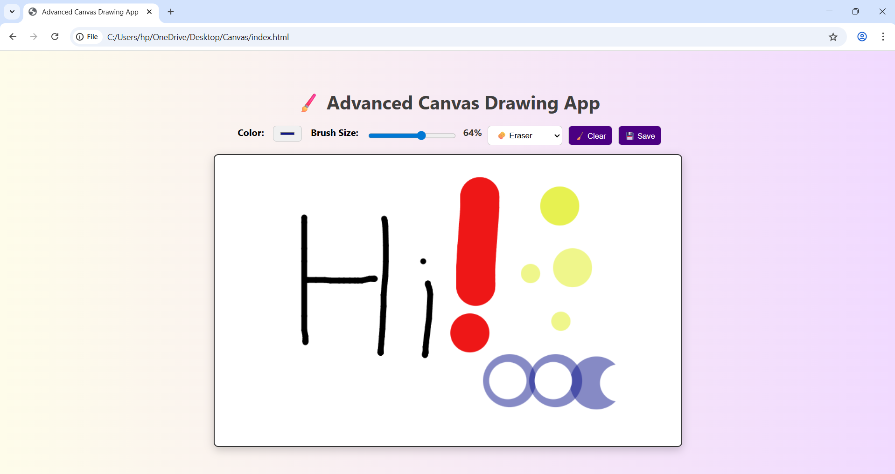

# 🎨 Advanced JavaScript Drawing App

This is a fully functional **Drawing App** built using **HTML**, **CSS**, and **JavaScript** with the Canvas API. The app allows users to draw using different brush types like pen, highlighter, and eraser, choose custom colors, change brush size (with % display), clear the canvas, and download their artwork as a PNG file.

---

## 🚀 Features

- 🖌️ Draw using Pen, Highlighter, and Eraser
- 🌈 Choose custom brush color
- 📏 Adjustable brush size (1% to 100%) with live value display
- 🧽 Clear canvas
- 💾 Save your drawing as a PNG image
- 📱 Fully responsive & creative UI

---

## 🌐 Live Demo

---

## 📸 Screenshot

  

---

## 🛠️ Tech Stack

- HTML5
- CSS3 (Flexbox, Gradients)
- JavaScript (Canvas API)

---

## 🧠 How to Use

1. Open the app in a browser.
2. Choose a brush type: Pen, Highlighter, or Eraser.
3. Pick your desired color and brush size.
4. Start drawing on the canvas using your mouse!
5. Use:
   - 🧹 **Clear** to reset the canvas
   - 💾 **Save** to download your drawing as PNG

